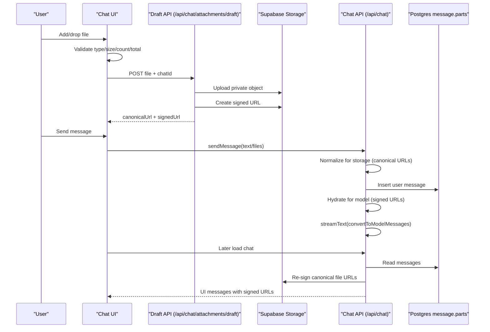

# Attachment Support Implementation Notes

This document explains the attachment feature as implemented in this repository, with the level of detail expected for maintainers reviewing an external PR. It focuses on behavior, architecture decisions, code contracts, and operational implications.

## Scope and Intent

This implementation adds message attachments across the full chat lifecycle:

- adding files from the composer (`Add files or photos`)
- drag-and-drop over the chat main area
- attachment previews and per-file removal before send
- sending attachments through AI SDK message parts
- persistence for authenticated users using private Supabase Storage
- temporary (non-persistent) behavior for guests
- rendering file attachments above user message text

The design intentionally avoids DB schema migrations by storing attachments inside existing `message.parts` JSON and introducing a canonical URL scheme for storage references.

## High-Level Design

The system uses two URL forms for authenticated attachments:

- **Canonical URL** for persistence: `supabase://<bucket>/<encoded-path>`
- **Signed URL** for short-lived access: generated at upload/send/read time

The canonical URL is what gets persisted in the message row. Signed URLs are treated as transport/display/runtime artifacts.

### Why canonical + signed separation exists

If signed URLs were stored directly, messages would break after URL expiry. Persisting canonical storage references and signing at read/send time makes attachments durable while keeping the bucket private.

## File/Module Overview

### Attachment domain utilities

- `src/lib/attachments/constants.ts`
  - file count, per-file size, total size, allowed media types
  - defaults: 10 files, 10MB/file, 30MB total
- `src/lib/attachments/validation.ts`
  - shared validation and user-facing validation messages
- `src/lib/attachments/storage.ts`
  - filename sanitization
  - canonical URL encode/decode helpers
  - user-scoped draft path generation

### Supabase server client

- `src/lib/supabase/server.ts`
  - `createClient` from `@supabase/supabase-js`
  - service role credentials, no session persistence

### Draft attachment API

- `src/app/api/chat/attachments/draft/route.ts`
  - `POST` uploads one file and returns canonical+signed metadata
  - `DELETE` removes one canonical object (with ownership guard)

### Chat UI + orchestration

- `src/app/(sidebar)/(chat)/_hooks/use-chat-attachments.ts`
  - attachment state machine (`uploading`/`ready`/`error`)
  - auth upload progress via `XMLHttpRequest` (for upload progress events)
  - guest data URL conversion at send time
  - remove handling (abort + optional server delete)
- `src/app/(sidebar)/(chat)/_components/chat-input/chat-input.tsx`
  - previews above textarea
  - remove buttons
  - upload progress bars
  - hidden file input + keyboard shortcut (`Ctrl/Cmd + D`)
- `src/app/(sidebar)/(chat)/_components/chat-input/chat-input-actions.tsx`
  - wires menu action to file picker callback
- `src/app/(sidebar)/(chat)/_components/chat.tsx`
  - drag/drop overlay and file capture
  - attachment-aware send pipeline

### Message persistence and runtime hydration

- `src/app/api/chat/route.ts`
  - authenticated send normalization (persist canonical URLs)
  - model-time re-signing for canonical file parts
- `src/dal/chat.ts`
  - load-time re-signing for canonical file parts in stored messages
  - injects canonical URL in `providerMetadata.attachment.canonicalUrl` for traceability

### Rendering

- `src/app/(sidebar)/(chat)/_components/message.tsx`
  - user messages render file parts above text
  - image files render thumbnail only
  - non-images render extension badge + filename

### Env and deps

- `env.config.ts`
  - `SUPABASE_URL`
  - `SUPABASE_SERVICE_ROLE_KEY`
  - `SUPABASE_STORAGE_BUCKET` (default `chat-attachments`)
  - `SUPABASE_SIGNED_URL_TTL_SECONDS` (default `3600`)
- `.env.example`
  - corresponding entries
- `package.json`
  - `@supabase/supabase-js`

## Runtime Flow Details

### 1) Authenticated user adds files

When files are added (picker or drop), client-side validation is applied immediately:

- media type allowed?
- non-empty file?
- <= 10MB per file?
- <= 10 files total?
- <= 30MB total?

Accepted files enter local state with `uploading` status and are uploaded one-by-one through `/api/chat/attachments/draft` using `XMLHttpRequest` so upload progress can be displayed.

Server `POST` behavior:

1. authenticate user
2. validate `chatId` and `file`
3. validate attachment type/size
4. upload to private bucket under path:
   `users/<sanitized-user-id>/drafts/<sanitized-chat-id>/<uuid>-<sanitized-filename>`
5. create signed URL
6. return:

```json
{
  "filename": "...",
  "mediaType": "...",
  "size": 123,
  "canonicalUrl": "supabase://chat-attachments/users%2F...",
  "signedUrl": "https://..."
}
```

Client stores both URLs. Signed URL is used for immediate preview/send; canonical URL is carried in metadata so server can persist stable references.

### 2) Guest user adds files

Guests never upload to Supabase. Files are stored as `File` objects in local attachment state.

At send time, each file is converted into a Data URL (`FileReader`) and sent as AI SDK `file` parts.

### 3) Remove attachment before send

Client removes local preview entry. If upload is in progress, it aborts XHR.

If authenticated and a canonical URL exists, client calls `DELETE /api/chat/attachments/draft`:

- validates canonical URL shape
- enforces expected bucket
- enforces user ownership by required `users/<userId>/` prefix
- removes object from storage

This is **opportunistic cleanup**. There is no scheduled stale draft sweeper yet.

### 4) Sending an authenticated message

In `chat.tsx`, send is blocked when uploads are still in progress. Once ready:

- send payload may be text-only, files-only, or text+files
- for files, the client sends AI SDK file parts with:
  - `url`: current signed URL
  - `providerMetadata.attachment.canonicalUrl`: stable storage URL

`/api/chat/route.ts` then creates two message views:

- **storage view** (`normalizeMessageForStorage`): file part URLs converted to canonical URLs before DB insert
- **model view** (`hydrateMessageForModel`): file part URLs converted/signed for model invocation

The user message is inserted first (existing behavior retained), then model call continues.

### 5) Reading persisted messages

`getChatWithMessages` in `src/dal/chat.ts` rehydrates file parts on read:

- parse canonical URL from `part.url`
- generate signed URL
- replace `part.url` with signed URL
- preserve canonical URL inside `providerMetadata.attachment.canonicalUrl`

This makes the UI and model pipeline consume valid URLs while DB remains canonical.

## AI SDK Integration

This implementation uses AI SDK `FileUIPart` as transport format. File parts are sent with `sendMessage` via:

- `sendMessage({ text, files })`
- or `sendMessage({ files })` for attachment-only messages

`convertToModelMessages` handles file parts in both authenticated and guest flows.

## UI/UX Behavior Notes

### Composer previews

- previews sit above textarea
- image preview: image tile only, no filename
- non-image preview: extension badge + filename
- each preview has remove action
- uploading entries show progress; error entries show inline message

### Drag and drop

Drop handling is attached to the chat main area wrapper in `chat.tsx`, not the sidebar layout, so interaction aligns with requested scope.

Overlay behavior:

- activates on drag enter with file payload
- tracks drag depth to avoid flicker on nested enter/leave
- hides on drop/leave completion

### Toast behavior

Toasts are emitted for:

- unsupported type / empty file / size violations / file count / total size
- upload failures
- delete cleanup failures
- send attempt while uploads in progress
- attachment preparation failures

## Security and Access Model

- bucket is expected private
- storage operations are server-side only with service role key
- delete endpoint requires auth and enforces user-owned prefix
- signed URLs are short-lived (TTL env controlled)

This keeps object access constrained while still allowing model and UI consumption.

## What Did Not Change

- No new DB tables or columns
- No migration files
- Guest API route (`/api/chat/guest`) logic unchanged, but now naturally accepts file parts through existing `messages` payload
- Message metadata type (`src/types/ui-message.ts`) unchanged

## Known Tradeoffs / Current Limitations

1. Draft namespace is used for persisted objects. There is no move/rename to a “final” namespace after send.
2. Cleanup is opportunistic (remove-on-delete), not lifecycle-managed. Abandoned uploads may remain until a future cleanup job is added.
3. Server-side `POST /api/chat/attachments/draft` validates type/size per file, but aggregate constraints (count/total bytes across current unsent draft) are primarily enforced client-side.
4. Image rendering intentionally uses `` (with lint suppression) because previews include blob and signed URLs; this avoids unnecessary complexity with `next/image` for transient URLs.

## Operational Checklist

For local/prod correctness:

1. set env values in `.env`
2. ensure bucket exists and is private
3. verify service role key is server-only
4. run:
   - `pnpm lint`
   - `pnpm -s tsc --noEmit`
   - `pnpm build`

## Review-Oriented Walkthrough

If reviewing this as a maintainer, a practical order is:

1. `src/lib/attachments/*` (domain invariants and canonical URL strategy)
2. `src/app/api/chat/attachments/draft/route.ts` (upload/delete contract + auth guard)
3. `src/app/(sidebar)/(chat)/_hooks/use-chat-attachments.ts` (client state machine)
4. `src/app/(sidebar)/(chat)/_components/chat.tsx` and `chat-input.tsx` (integration and UX)
5. `src/app/api/chat/route.ts` + `src/dal/chat.ts` (persistence normalization + hydration)
6. `src/app/(sidebar)/(chat)/_components/message.tsx` (rendering contract)

This order follows the same layering used during implementation: domain -> API -> client orchestration -> persistence -> rendering.

## Sequence Diagram



---

If future work is prioritized, the first recommended follow-up is introducing a draft attachment lifecycle sweeper and/or move-to-final-path on successful send.
